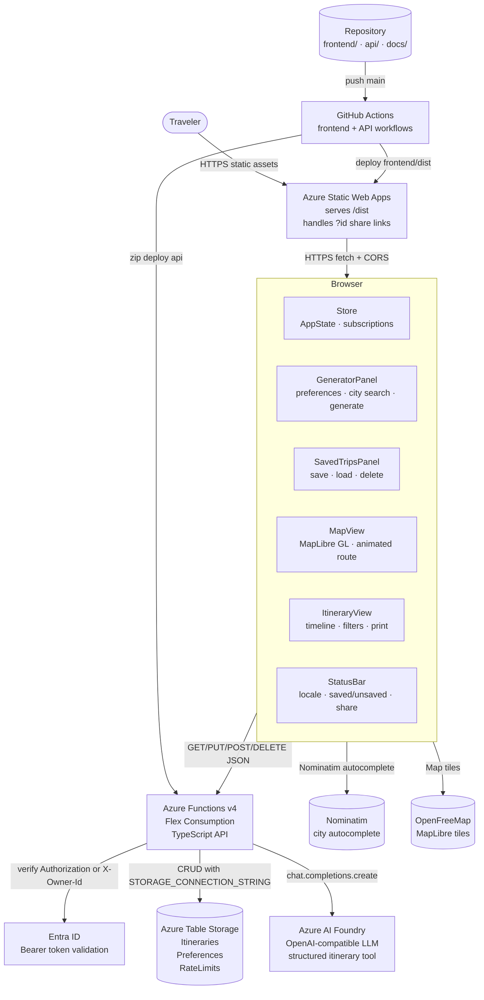

# NordicHolidays

[](https://github.com/toinevl/nordicHolidays/actions/workflows/ci.yml)

Plan your Nordic holiday by selecting a start and end point — we’ll generate the rest with AI.

**Live app:** https://nordicholidays.azurestaticapps.net

---

## Features

- **AI itinerary generation** — Azure AI Foundry (via OpenAI SDK) generates structured day-by-day trips across the Nordics
- **Interactive map** — MapLibre GL with animated route polyline and colour-coded region markers
- **Save & load trips** — persist itineraries to Azure Table Storage and reload them in one click
- **Share via URL** — every saved trip gets a shareable `?id=` link
- **Print / PDF export** — print-optimised stylesheet for clean offline use
- **Navigation export** — send any itinerary to **Google Maps** (multi-stop driving route) or **Waze** (navigate to final destination) via deep-link; also export as **GPX** (sat-nav waypoints) or **iCal** (calendar events)
- **Day-by-day timeline** — stop cards with drive distances, tips, and region colour tags
- **Season & weather callouts** — packing and activity advice per trip
- **Regenerate** — instantly produce a fresh itinerary with the same parameters

---

## Local Development

**Frontend**
```bash
cd frontend && npm install && npm run dev
```
Opens at http://localhost:5173.

**API**
```bash
cd api && npm install
# Add STORAGE_CONNECTION_STRING + AZURE_FOUNDRY_API_KEY + AZURE_FOUNDRY_ENDPOINT to api/local.settings.json
npm run start
```
Runs Azure Functions locally at http://localhost:7071.

**Tests**
```bash
cd frontend && npm test
cd api && npm test
```

---

## Architecture Overview

- **Frontend:** Vite + TypeScript static app deployed to Azure Static Web Apps (Free tier)
- **API:** Azure Functions v4 TypeScript on Flex Consumption at `https://nordic-holidays-api.azurewebsites.net`
- **Storage:** Azure Table Storage — `Itineraries`, `Preferences`, `Profiles`, and `RateLimits` tables (partitioned per owner)
- **AI:** Azure AI Foundry (OpenAI SDK, model `gpt-4o` by default) via server-side `POST /api/generate` with forced tool use for structured output



See [docs/architecture-diagram.md](docs/architecture-diagram.md) for the full Mermaid architecture documentation, including generation, save/share, load, and component responsibility flows.

---

## Storage

NordicHolidays uses **Azure Table Storage** exclusively for persistence. It stores `Itineraries`, `Preferences`, and `Profiles` tables under a unified `owner` model.


Open `docs/storage-architecture.excalidraw` in [Excalidraw](https://excalidraw.com) to edit/view the diagram.

### Owner model

Every row is keyed by `ownerId`. Two identities are supported:

- **Guest** — transient `owner-<uuid>` generated at startup and persisted in `localStorage` under `ownerId`
- **Entra signed-in user** — stable `entra-<sub>` derived from the Microsoft identity `sub` claim

Anonymous trip generation (`POST /api/generate`) remains open. Saved trips and preferences require a valid `ownerId`.

### Tables

| Table | Partition key | Row key | Notes |
|------|--------------|---------|-------|
| `Itineraries` | `owner` | `ownerId` | Saved/generated trip details |
| `Preferences` | `owner` | `ownerId` | UI prefs and feature flags |
| `Profiles` | `profile` | `ownerId` | Display name, email, created/updated timestamps, extensible JSON extensions |

### Local state
