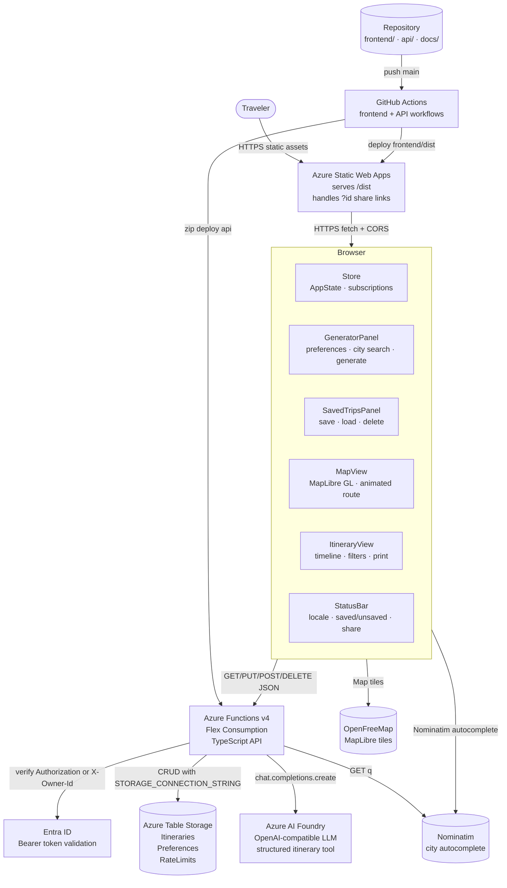

# SwedenTravel

An AI-powered road trip planner for Sweden. Generate personalised multi-day itineraries, explore them on an interactive map, and save your favourite routes for later.

**Live app:** https://zealous-forest-053645a03.7.azurestaticapps.net

---

## Features

- **AI itinerary generation** — Azure AI Foundry (via OpenAI SDK) generates structured day-by-day trips for any Swedish region and duration
- **Interactive map** — MapLibre GL with animated route polyline and colour-coded region markers
- **Save & load trips** — persist itineraries to Azure Table Storage and reload them in one click
- **Share via URL** — every saved trip gets a shareable `?id=` link
- **Print / PDF export** — print-optimised stylesheet for clean offline use
- **Day-by-day timeline** — stop cards with drive distances, tips, and region colour tags
- **Season & weather callouts** — packing and activity advice per trip
- **Regenerate** — instantly produce a fresh itinerary with the same parameters

---

## Local Development

**Frontend**
```bash
cd frontend && npm install && npm run dev
```
Opens at http://localhost:5173.

**API**
```bash
cd api && npm install
# Add STORAGE_CONNECTION_STRING + AZURE_FOUNDRY_API_KEY + AZURE_FOUNDRY_ENDPOINT to api/local.settings.json
npm run start
```
Runs Azure Functions locally at http://localhost:7071.

**Tests**
```bash
cd frontend && npm test
cd api && npm test
```

---

## Architecture Overview

- **Frontend:** Vite + TypeScript static app deployed to Azure Static Web Apps (Free tier)
- **API:** Azure Functions v4 TypeScript on Flex Consumption at `https://sweden-travel-api.azurewebsites.net`
- **Storage:** Azure Table Storage — `Itineraries`, `Preferences`, `Profiles`, and `RateLimits` tables (partitioned per owner)
- **AI:** Azure AI Foundry (OpenAI SDK, model `gpt-4o` by default) via server-side `POST /api/generate` with forced tool use for structured output



See [docs/architecture-diagram.md](docs/architecture-diagram.md) for the full Mermaid architecture documentation, including generation, save/share, load, and component responsibility flows.

---

## Storage

SwedenTravel uses **Azure Table Storage** exclusively for persistence. It stores `Itineraries`, `Preferences`, and `Profiles` tables under a unified `owner` model.


Open `docs/storage-architecture.excalidraw` in [Excalidraw](https://excalidraw.com) to edit/view the diagram.

### Owner model

Every row is keyed by `ownerId`. Two identities are supported:

- **Guest** — transient `owner-<uuid>` generated at startup and persisted in `localStorage` under `ownerId`
- **Entra signed-in user** — stable `entra-<sub>` derived from the Microsoft identity `sub` claim

Anonymous trip generation (`POST /api/generate`) remains open. Saved trips and preferences require a valid `ownerId`.

### Tables

| Table | Partition key | Row key | Notes |
|------|--------------|---------|-------|
| `Itineraries` | `owner` | `ownerId` | Saved/generated trip details |
| `Preferences` | `owner` | `ownerId` | UI prefs and feature flags |
| `Profiles` | `profile` | `ownerId` | Display name, email, created/updated timestamps, extensible JSON extensions |

### Local state

- `localStorage` keys: `ownerId`, `swedentravel_profile`
- MSAL token cache: browser `localStorage` for the SPA session
- Refresh tokens are held in-memory/OS chrome storage only, never persisted server-side

---

## Deploy

Two independent GitHub Actions workflows trigger on pushes to `main` with path filters so only the changed component redeploys.

| Workflow | File | Deploys |
|---|---|---|
| Frontend | `.github/workflows/deploy-frontend.yml` | Azure Static Web Apps |
| API | `.github/workflows/deploy-api.yml` | Azure Functions (Flex Consumption) |

**Required secrets** (set in GitHub repository settings):

| Secret | Used by |
|---|---|
| `AZURE_STATIC_WEB_APPS_API_TOKEN` | deploy-frontend.yml |
| `AZURE_FUNCTIONAPP_PUBLISH_PROFILE` | deploy-api.yml |
| `AZURE_FOUNDRY_API_KEY` | API runtime (set in Function App config, references Key Vault secret) |
| `AZURE_FOUNDRY_ENDPOINT` | API runtime (set in Function App config) |
| `TABLES_ENDPOINT` | API runtime (Azure Table Storage, uses managed identity in production) |

---

## Docs

- [Architecture](docs/architecture.md) — topology, repo structure, data flows, state management
- [API Reference](docs/api.md) — all 7 endpoints with request/response examples
- [Features Guide](docs/features.md) — detailed description of every user-facing feature

<!-- redeploy trigger -->
