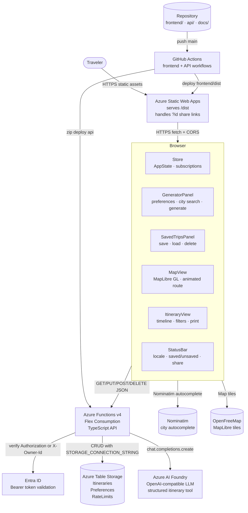

# Fjordvia / RouteKit

[](https://github.com/toinevl/nordicHolidays/actions/workflows/ci.yml)

**Fjordvia** — AI-Planned Road Trips Across the Nordics. Plan your Nordic holiday by selecting a start and end point — we'll generate the rest with AI.

**RouteKit** — AI-Planned Road Trips Across the United States. Same engine, US data pack.

Both apps share a single codebase. Region-specific data (countries, cities, seasons, default itinerary, LLM prompt, branding) is config-driven and selected at build time.

**Live app:** <https://sweden.van-vliet.eu> — AI road-trip planner for the Nordics

---

## Features

- **AI itinerary generation** — Azure AI Foundry (via OpenAI SDK) generates structured day-by-day trips across the Nordics
- **Interactive map** — MapLibre GL with animated route polyline and colour-coded region markers
- **Save & load trips** — persist itineraries to Azure Table Storage and reload them in one click
- **Share via URL** — every saved trip gets a shareable `?id=` link
- **Print / PDF export** — print-optimised stylesheet for clean offline use
- **Navigation export** — send any itinerary to **Google Maps** (multi-stop driving route) or **Waze** (navigate to final destination) via deep-link; also export as **GPX** (sat-nav waypoints) or **iCal** (calendar events)
- **Day-by-day timeline** — stop cards with drive distances, tips, and region colour tags
- **Season & weather callouts** — packing and activity advice per trip
- **Optional trip start date** — generates a route tailored to the season (#96)
- **Date-aware itinerary view** — calendar dates shown on every stop, trip summary, and exports (#97)
- **Itinerary management** — add or remove destinations inline, and regenerate the route while respecting your manual edits (#98)
- **Undo** — revert a single edit cycle if the regeneration or removal wasn’t what you wanted
- **Notes** — per-stop user notes persisted alongside AI suggestions

---

## Local Development

**Frontend**
```bash
cd frontend && npm install && npm run dev
```
Opens at http://localhost:5173.

**API**
```bash
cd api && npm install
# Add STORAGE_CONNECTION_STRING + AZURE_FOUNDRY_API_KEY + AZURE_FOUNDRY_ENDPOINT to api/local.settings.json
npm run start
```
Runs Azure Functions locally at http://localhost:7071.

**Tests**
```bash
cd frontend && npm test
cd api && npm test
```

---

## Multi-Region Support

This codebase serves multiple travel regions from a single shared codebase. The active region is selected at build time via the `VITE_REGION` (frontend) and `REGION` (API) environment variables.

| Region | Brand | Env value | Countries | Default trip |
|--------|-------|-----------|-----------|-------------|
| Nordic | Fjordvia | `nordic` (default) | SE, NO, DK, FI | Sweden 21-day Grand Tour |
| US | RouteKit | `us` | US | Pacific Coast Highway + Rockies |

### What's region-specific

- Countries (dropdown + LLM prompt), cities (autocomplete), season data (UI tooltips)
- Default itinerary (stops, culinary regions, accommodations)
- Map defaults (center/zoom), brand name, hero content, footer tagline
- API: LLM prompt template, 12-month seasonal context, border constraint

### Region config location

```
frontend/src/region/   types.ts · nordic.ts · us.ts · index.ts (resolver)
api/src/region/        types.ts · nordic.ts · us.ts · index.ts (resolver)
```

### Deploying for US

Set `VITE_REGION=us` in the frontend build env and `REGION=us` in the API app settings. No code changes needed — the region config resolver picks up the US data pack automatically.

### Adding a new region

1. Create `frontend/src/region/<name>.ts` implementing `RegionConfig`
2. Create `api/src/region/<name>.ts` implementing `ApiRegionConfig`
3. Register both in their respective `index.ts` files
4. Add region-specific i18n keys (country names, season notes, hero content)
5. Set `VITE_REGION` / `REGION` env var at deploy time

---

## Architecture Overview

- **Frontend:** Vite + TypeScript static app deployed to Azure Static Web Apps (Free tier)
- **API:** Azure Functions v4 TypeScript on Flex Consumption at `https://nordic-holidays-api.azurewebsites.net`
- **Storage:** Azure Table Storage — `Itineraries`, `Preferences`, `Profiles`, and `RateLimits` tables (partitioned per owner)
- **AI:** Azure AI Foundry (OpenAI SDK, model `gpt-4o` by default) via server-side `POST /api/generate` with forced tool use for structured output


```mermaid
flowchart TB
  Traveler([Traveler])

  subgraph Browser["Browser"]
    Store[Store<br/>AppState · subscriptions]
    GeneratorPanel[GeneratorPanel<br/>preferences · city search · generate]
    SavedTripsPanel[SavedTripsPanel<br/>save · load · delete]
    MapView[MapView<br/>MapLibre GL · animated route]
    ItineraryView[ItineraryView<br/>timeline · filters · print]
    StatusBar[StatusBar<br/>locale · saved/unsaved · share]
  end

  SWA[Azure Static Web Apps<br/>serves /dist<br/>handles ?id share links]
  API[Azure Functions v4<br/>Flex Consumption<br/>TypeScript API]
  Table[(Azure Table Storage<br/>Itineraries<br/>Preferences<br/>RateLimits)]
  LLM[Azure AI Foundry<br/>OpenAI-compatible LLM<br/>structured itinerary tool]
  City[(Nominatim<br/>city autocomplete)]
  Tiles[(OpenFreeMap<br/>MapLibre tiles)]
  Entra[Entra ID<br/>Bearer token validation]
  GitHub[GitHub Actions<br/>frontend + API workflows]
  Repo[(Repository<br/>frontend/ · api/ · docs/)]

  Traveler -->|HTTPS static assets| SWA
  SWA -->|HTTPS fetch + CORS| Browser
  Browser -->|GET/PUT/POST/DELETE JSON| API
  API -->|verify Authorization or X-Owner-Id| Entra
  API -->|CRUD with STORAGE_CONNECTION_STRING| Table
  API -->|chat.completions.create| LLM
  Browser -->|Nominatim autocomplete| City
  Browser -->|Map tiles| Tiles
  Repo -->|push main| GitHub
  GitHub -->|deploy frontend/dist| SWA
  GitHub -->|zip deploy api| API
```

See [docs/architecture-diagram.md](docs/architecture-diagram.md) for the full Mermaid architecture documentation, including generation, save/share, load, and component responsibility flows.

---

## Storage

Fjordvia uses **Azure Table Storage** exclusively for persistence. It stores `Itineraries`, `Preferences`, and `Profiles` tables under a unified `owner` model.


Open `docs/storage-architecture.excalidraw` in [Excalidraw](https://excalidraw.com) to edit/view the diagram.

### Owner model

Every row is keyed by `ownerId`. Two identities are supported:

- **Guest** — transient `owner-<uuid>` generated at startup and persisted in `localStorage` under `ownerId`
- **Entra signed-in user** — stable `entra-<sub>` derived from the Microsoft identity `sub` claim

Anonymous trip generation (`POST /api/generate`) remains open. Saved trips and preferences require a valid `ownerId`.

### Tables

| Table | Partition key | Row key | Notes |
|------|--------------|---------|-------|
| `Itineraries` | `owner` | `ownerId` | Saved/generated trip details |
| `Preferences` | `owner` | `ownerId` | UI prefs and feature flags |
| `Profiles` | `profile` | `ownerId` | Display name, email, created/updated timestamps, extensible JSON extensions |

### Local state
