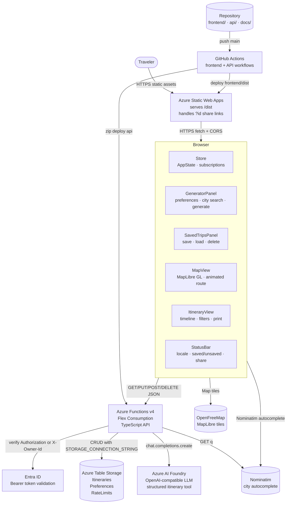
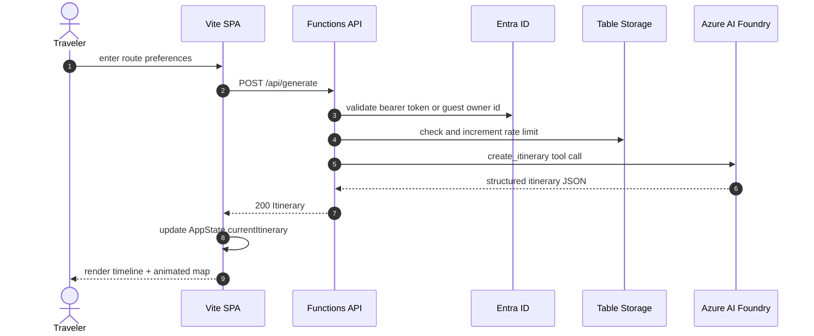
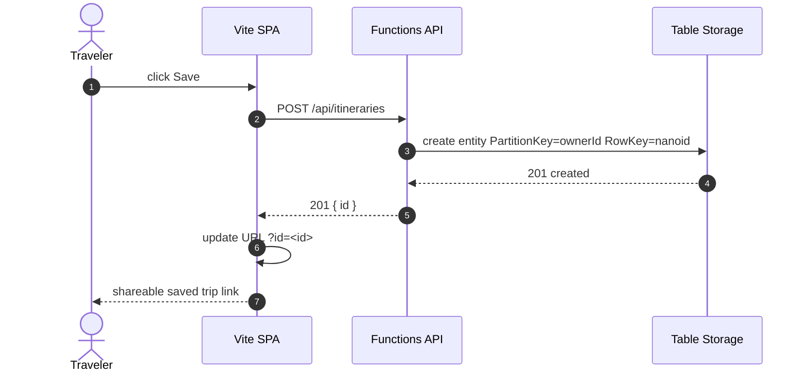
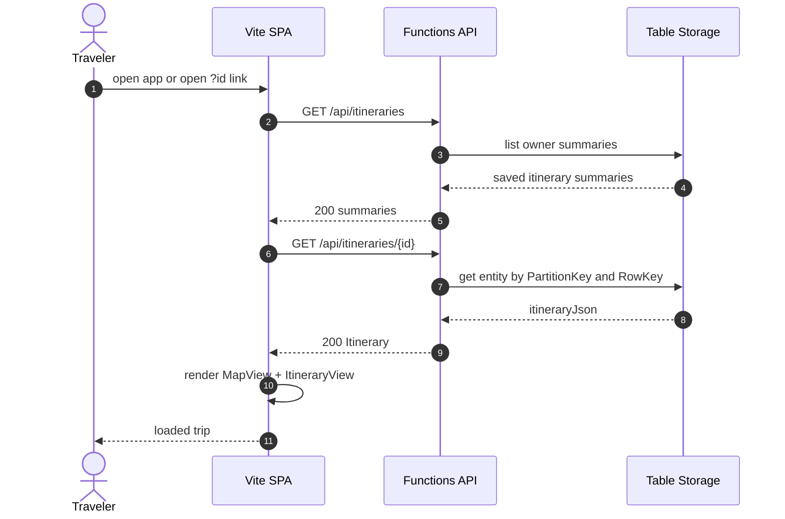
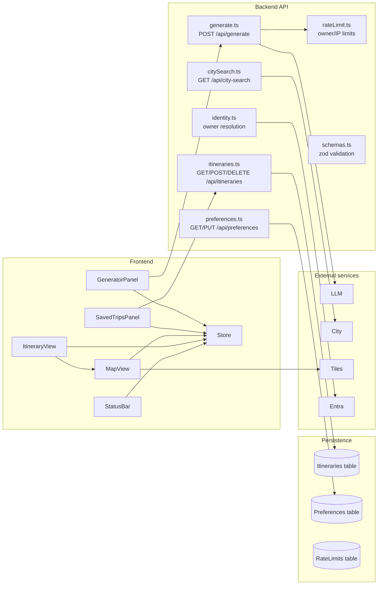

# SwedenTravel Architecture Diagram

## Runtime topology

```mermaid
flowchart TB
  Traveler([Traveler])

  subgraph Browser["Browser"]
    Store[Store<br/>AppState · subscriptions]
    GeneratorPanel[GeneratorPanel<br/>preferences · city search · generate]
    SavedTripsPanel[SavedTripsPanel<br/>save · load · delete]
    MapView[MapView<br/>MapLibre GL · animated route]
    ItineraryView[ItineraryView<br/>timeline · filters · print]
    StatusBar[StatusBar<br/>locale · saved/unsaved · share]
  end

  SWA[Azure Static Web Apps<br/>serves /dist<br/>handles ?id share links]
  API[Azure Functions v4<br/>Flex Consumption<br/>TypeScript API]
  Table[(Azure Table Storage<br/>Itineraries<br/>Preferences<br/>RateLimits)]
  LLM[Azure AI Foundry<br/>OpenAI-compatible LLM<br/>structured itinerary tool]
  City[(Nominatim<br/>city autocomplete)]
  Tiles[(OpenFreeMap<br/>MapLibre tiles)]
  Entra[Entra ID<br/>Bearer token validation]
  GitHub[GitHub Actions<br/>frontend + API workflows]
  Repo[(Repository<br/>frontend/ · api/ · docs/)]

  Traveler -->|HTTPS static assets| SWA
  SWA -->|HTTPS fetch + CORS| Browser
  Browser -->|GET/PUT/POST/DELETE JSON| API
  API -->|verify Authorization or X-Owner-Id| Entra
  API -->|CRUD with STORAGE_CONNECTION_STRING| Table
  API -->|chat.completions.create| LLM
  API -->|GET q| City
  Browser -->|Nominatim autocomplete| City
  Browser -->|Map tiles| Tiles
  Repo -->|push main| GitHub
  GitHub -->|deploy frontend/dist| SWA
  GitHub -->|zip deploy api| API
```

## AI itinerary generation flow

```mermaid
sequenceDiagram
  autonumber
  actor Traveler
  participant SPA as Vite SPA
  participant API as Functions API
  participant Entra as Entra ID
  participant Table as Table Storage
  participant LLM as Azure AI Foundry

  Traveler->>SPA: enter route preferences
  SPA->>API: POST /api/generate
  API->>Entra: validate bearer token or guest owner id
  API->>Table: check and increment rate limit
  API->>LLM: create_itinerary tool call
  LLM-->>API: structured itinerary JSON
  API-->>SPA: 200 Itinerary
  SPA->>SPA: update AppState.currentItinerary
  SPA-->>Traveler: render timeline + animated map
```

## Save and share trip flow

```mermaid
sequenceDiagram
  autonumber
  actor Traveler
  participant SPA as Vite SPA
  participant API as Functions API
  participant Table as Table Storage

  Traveler->>SPA: click Save
  SPA->>API: POST /api/itineraries
  API->>Table: create entity PartitionKey=ownerId RowKey=nanoid
  Table-->>API: 201 created
  API-->>SPA: 201 { id }
  SPA->>SPA: update URL ?id=<id>
  SPA-->>Traveler: shareable saved trip link
```

## Load saved trip flow

```mermaid
sequenceDiagram
  autonumber
  actor Traveler
  participant SPA as Vite SPA
  participant API as Functions API
  participant Table as Table Storage

  Traveler->>SPA: open app or open ?id link
  SPA->>API: GET /api/itineraries
  API->>Table: list owner summaries
  Table-->>API: saved itinerary summaries
  API-->>SPA: 200 summaries
  SPA->>API: GET /api/itineraries/{id}
  API->>Table: get entity by PartitionKey and RowKey
  Table-->>API: itineraryJson
  API-->>SPA: 200 Itinerary
  SPA->>SPA: render MapView + ItineraryView
  SPA-->>Traveler: loaded trip
```

## Component responsibility map

```mermaid
flowchart LR
  subgraph Frontend["Frontend"]
    direction TB
    GeneratorPanel
    SavedTripsPanel
    MapView
    ItineraryView
    StatusBar
    Store
  end

  subgraph API["Backend API"]
    direction TB
    Generate["generate.ts<br/>POST /api/generate"]
    Itineraries["itineraries.ts<br/>GET/POST/DELETE /api/itineraries"]
    Preferences["preferences.ts<br/>GET/PUT /api/preferences"]
    CitySearch["citySearch.ts<br/>GET /api/city-search"]
    Identity["identity.ts<br/>owner resolution"]
    RateLimit["rateLimit.ts<br/>owner/IP limits"]
    Schemas["schemas.ts<br/>zod validation"]
  end

  subgraph Storage["Persistence"]
    direction TB
    ItinerariesTable[(Itineraries table)]
    PreferencesTable[(Preferences table)]
    RateLimitsTable[(RateLimits table)]
  end

  subgraph External["External services"]
    direction TB
    LLM
    City
    Tiles
    Entra
  end

  GeneratorPanel --> Store
  SavedTripsPanel --> Store
  MapView --> Store
  ItineraryView --> Store
  StatusBar --> Store

  GeneratorPanel --> Generate
  SavedTripsPanel --> Itineraries
  MapView --> Tiles
  ItineraryView --> MapView
  Preferences --> PreferencesTable
  Generate --> LLM
  Generate --> RateLimit
  Itineraries --> ItinerariesTable
  CitySearch --> City
  Identity --> Entra
```
