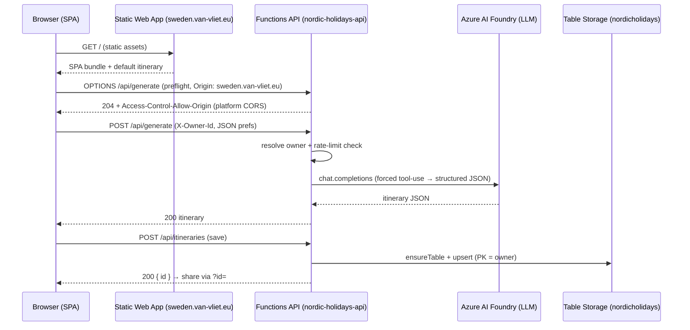
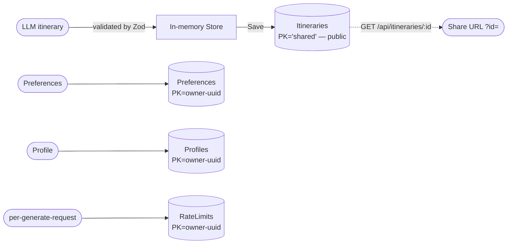

# NordicHolidays Architecture

> NordicHolidays is an AI-generated Nordic road-trip itinerary app: a Vite + TypeScript SPA hosted on Azure Static Web Apps, calling an Azure Functions (Flex Consumption) API that generates itineraries via Azure AI Foundry and persists them in Azure Table Storage. It is anonymous — no user accounts. **Saved itineraries are fully public** (anyone can create, view, and edit any itinerary — see #47); Preferences, Profile, and generation rate-limiting remain isolated by a client-generated owner id. Production frontend: **https://sweden.van-vliet.eu**.

This document is organised into four articles: [Communication Flow](#1-communication-flow) · [Data Flow](#2-data-flow) · [Cloud Resources](#3-cloud-resources) · [Security & Identity](#4-security--identity). A repository map and state-management reference are in the [Appendix](#appendix).

---

## 1. Communication Flow

One client, one static host, one serverless API, and two downstream services (storage + LLM). The frontend and API are cross-origin, so **every state-changing request is preceded by a CORS preflight** — a real hop that is configured independently of the app code and a frequent source of outages.



**Protocols & paths**
- Browser → SWA: HTTPS, static assets only. Client routing is hash-based (`#itinerary`, `#culinary-section`, `#accom-section`, `#map-page`); share links use `?id=<uuid>`.
- Browser → API: HTTPS `fetch` to `https://nordic-holidays-api.azurewebsites.net/api/*`. The base URL is the hardcoded fallback in `frontend/src/api/client.ts` (no `VITE_API_BASE` is set). Headers: `Content-Type: application/json`, `X-Owner-Id: owner-<uuid>` on every call; `Authorization` is never sent (guest auth stub returns `null`).
- API → Storage: `@azure/data-tables` `TableClient` over HTTPS (connection string in app settings, or managed identity via `TABLES_ENDPOINT`).
- API → AI Foundry: OpenAI SDK at `{AZURE_FOUNDRY_ENDPOINT}/deployments/{LLM_MODEL}`, `api-key` auth.

**Endpoints** (`authLevel: anonymous`, registered per function file): `GET /api/health`, `POST /api/generate`, `GET|POST /api/itineraries`, `GET|PATCH /api/itineraries/:id` (no `DELETE` — removed with the delete-from-UI change, #12), `GET|PUT /api/preferences`, `GET|PUT /api/profile`, `GET /api/city-search`.

**Generate request lifecycle** (detailed):
```
User fills GeneratorPanel (country, start/end city, days, must-visit, avoid)
  → POST /api/generate { ...prefs, lang }
    → resolveOwnerId (X-Owner-Id) → checkAndIncrementRateLimit (RateLimits table)
    → llmClient: chat.completions, tool_choice: required (create_itinerary)
    → validate JSON → return Itinerary
  → store.currentItinerary = response
    → ItineraryView renders timeline · MapView draws route · StatusBar = "Unsaved"
```

**Error path:** a non-2xx is caught in `request()` and surfaced as a toast `"<status>: <error>"`. A preflight that returns no matching `Access-Control-Allow-Origin` is reported by the browser as a generic *"NetworkError when attempting to fetch resource"* — which masks the real (CORS) cause from the user.

---

## 2. Data Flow

Data is small. Itineraries are a single shared pool; Preferences, Profile, and RateLimits remain per-owner. The generated itinerary is **ephemeral until the user saves** — generation writes nothing; only an explicit save persists.



| Entity | Store | Partition key | Lifecycle |
|---|---|---|---|
| Itinerary | `Itineraries` table | constant `'shared'` — **public, no owner scoping** (#47) | durable once saved; generated-but-unsaved is ephemeral; visible/editable by anyone |
| Preferences | `Preferences` table | `owner-<uuid>` | durable, PUT-upserted |
| Profile | `Profiles` table | `owner-<uuid>` | durable; `extensions` stored as a JSON string |
| RateLimit | `RateLimits` table | `owner-<uuid>` | rolling counter, checked only by `/api/generate` |

**Transformations**
- Generate: the LLM returns a `create_itinerary` tool call; its arguments are parsed, validated (`validateItinerary` + Zod `GenerateRequestBodySchema`), then returned to the browser (ephemeral) or, on save, written as a Table entity.
- Profile `extensions`: JSON-stringified on write, parsed on read (fixed in the current release — previously stored as an object, which Table Storage does not round-trip correctly).
- Tables are created lazily via `ensureTable()` before the first write (ignores 409 "already exists").

**Save & reload**
```
SAVE:  POST /api/itineraries { name, itinerary }
         → ensureTable + upsert (partitionKey=owner, rowKey=id) → { id }
         → store.activeTripId = id; URL → ?id=<id>
RELOAD: GET /api/itineraries       (summary list)
        GET /api/itineraries/:id   (full itinerary) → store re-renders Map + Timeline
```

**Isolation:** `owner-<uuid>` partitioning still isolates Preferences, Profile, and RateLimits — the API resolves the owner server-side and scopes every query to that partition, and a guest cannot address another guest's partition key there. **Itineraries have no isolation at all** (#47): every itinerary lives under one constant partition key, `list`/`get`/`save`/`patch` never check who's asking, and there is no owner or attribution field on the entity. This is an intentional design choice (anyone can create and share trips), not a bug — but it means anyone can also overwrite or vandalize any other visitor's saved trip, and there is currently no rate limit on itinerary writes (unlike `/api/generate`, which is rate-limited per owner).

**Client state** (`frontend/src/store.ts`) — a plain object with mutation helpers; no framework reactivity, UI re-renders via explicit `render()` calls:

| Field | Type | Description |
|---|---|---|
| `currentItinerary` | `Itinerary \| null` | Active itinerary on map + timeline |
| `savedItineraries` | `ItinerarySummary[]` | List in SavedTripsPanel |
| `preferences` | `UserPreferences` | Persisted travel preferences |
| `isGenerating` | `boolean` | True while POST /api/generate is in-flight |
| `unsaved` | `boolean` | True when currentItinerary has not been saved |
| `activeTripName` / `activeTripId` | `string \| null` | Display name / Table rowKey of the active trip |
| `selectedStopId` / `currentFilter` | `string \| null` | Highlighted stop / active region filter |
| `ownerId` | `string \| null` | Guest (`owner-<uuid>`) or signed-in (`entra-<sub>`) identifier |
| `userProfile` | `UserProfile \| null` | Display name, email, timestamps |

---

## 3. Cloud Resources

All resources live in resource group **`rgNordicHolidays`**, subscription `2dbeb3f1-e45d-4207-a7e9-185330aad74b`, region **westeurope**. Reference IaC: `infra/main.bicep`.

| Resource | Name | SKU / Tier | Notes |
|---|---|---|---|
| Static Web App | `nordicholidays` | Free | Custom domain **`sweden.van-vliet.eu`**; default host `agreeable-island-03429a403.7.azurestaticapps.net`. The old `nordicholidays.azurestaticapps.net` hostname is dead (404). |
| Function App | `nordic-holidays-api` | Flex Consumption, Node 22 | `https://nordic-holidays-api.azurewebsites.net`. System-assigned managed identity. `functionTimeout` not set (platform default). |
| Storage Account | `nordicholidays` | Standard LRS | Tables: Itineraries, Preferences, Profiles, RateLimits. Blob for deploy packages. |
| Key Vault | `kv-nordicholidays` | Standard (RBAC) | Holds the AI Foundry key. |
| AI Foundry | serverless endpoint | — | LLM via OpenAI SDK; default model `gpt-4o` (`LLM_MODEL`). |
| Application Insights | `nordic-holidays-api` | — | Traces / `logError()`; request sampling enabled. |

**Managed identity & RBAC**
- Function App identity → **Storage Table Data Contributor** on `nordicholidays`.
- Function App identity → **Key Vault Secrets User** on `kv-nordicholidays`.

**Deploy (GitHub Actions, on push to `main`)**
- `deploy-frontend.yml` — builds `frontend/dist`, deploys via `Azure/static-web-apps-deploy@v1` on `frontend/**` changes; smoke test with an expected-marker check. SWA URL from var `NORDIC_HOLIDAYS_SWA_URL`.
- `deploy-api.yml` — `npm ci` + build + zip-deploy (`az functionapp deployment source config-zip`) on `api/**` changes; sets `ENTRA_*` app settings; smoke-tests the API.
- `ci.yml` — build + test gate.
- Workflow authN: **GitHub OIDC** federated credential on Entra app `nordicHolidays-github-deploy` (Contributor on `rgNordicHolidays`).

**⚠ Managed manually — not in Bicep (drift / recreate risk):**
1. The Entra app registration `nordicHolidays-github-deploy` + its OIDC federated credential (Graph-managed).
2. The SWA custom domain `sweden.van-vliet.eu`.

The platform-level CORS allow-list (`az functionapp cors`) is now persisted in `infra/main.bicep` (`corsAllowedOrigins` param, wishlist #32) — no longer a drift risk. Recreating the Function App from Bicep alone would still silently drop items 1–2 above and break the live site.

---

## 4. Security & Identity

**User authentication — anonymous guest.** There are no accounts. On first load the browser generates `owner-<uuid>`, stores it in `localStorage` with a **rolling 30-day expiry**, and sends it as the `X-Owner-Id` header on every API call. Entra/MSAL sign-in and JWT verification (`jose`, `api/src/lib/identity.ts`) are **implemented but disabled** — the frontend auth stub (`frontend/src/lib/auth.ts`) returns `null`/`false` for every method, so no bearer token is ever produced and `verifyAccessToken` is never reached. The code is staged for a future Entra rollout.

**Authorization & isolation — two different models now (#47).**
- **Preferences / Profile / RateLimits (soft, not cryptographic):** the API resolves the owner from the **client-supplied `X-Owner-Id` header** (`resolveOwnerId`) and uses it as the Table partition key for every read/write. This isolates guests *by default* — there is no shared or admin read path — but it is **not** a cryptographic boundary: anyone who learns a guest's `owner-<uuid>` (e.g. a leaked `localStorage` or shared URL) can send that header and read/write that guest's data. Accepted risk: the data is low-sensitivity, the uuid is 128-bit random, and `/api/generate` is rate-limited per owner. Proper hardening (server-issued signed tokens) is deferred (#38).
- **Itineraries (intentionally public, #47):** `resolveOwnerId` is not called at all. `list`/`get`/`save`/`patch` have **no access control whatsoever** — every itinerary lives under one shared partition key, and any visitor can view, create, or edit any itinerary. This is a deliberate product decision (the app is a public trip-sharing tool, not an account system), not an oversight. Consequences worth naming plainly: (a) any visitor can silently overwrite or vandalize any other visitor's saved trip — there is no versioning, undo, or attribution to detect or revert this; (b) itinerary writes have **no rate limit** (unlike `/api/generate`), so the table has no defense against write-spam or storage-cost abuse; (c) `POST`/`PATCH` bodies are Zod-validated for shape but not for content, so this is also an unmoderated public content surface — anyone can write arbitrary trip names/city text (persisted, later rendered to other visitors; XSS risk is mitigated by output escaping — see Hardening below — but a determined abuser has no rate or identity friction to work through first).

**Service identity & secrets.** The Function App authenticates to Storage and Key Vault via its system-assigned **managed identity** + RBAC (no stored credentials). `AZURE_FOUNDRY_API_KEY`, `AZURE_FOUNDRY_ENDPOINT`, `STORAGE_CONNECTION_STRING`, and `LLM_MODEL` live in app settings; the Foundry key is sourced from Key Vault. Secrets are never committed (`.gitignore` covers `api/local.settings.json*`).

**CORS — two independent layers, now reconciled (#32, #33):**
- **Platform CORS** on the Function App (`az functionapp cors`) — **this is what actually governs** the browser preflight. Allow-list: `https://sweden.van-vliet.eu`, `http://localhost:5173`, `https://agreeable-island-03429a403.7.azurestaticapps.net`, and the dead `https://nordicholidays.azurestaticapps.net`. Persisted in `infra/main.bicep` (`corsAllowedOrigins`), so a Function-App recreate no longer drops it.
- **App-level CORS** in `api/src/lib/cors.ts`, driven by `ALLOWED_ORIGINS` — now **set in production** (`https://sweden.van-vliet.eu,http://localhost:5173`, via the same Bicep param) so code and prod config agree. Still effectively a no-op for preflight itself (platform CORS answers OPTIONS first), but it now matches rather than contradicts prod.

**Hardening controls**
- Response headers: `X-Content-Type-Options: nosniff`, `X-Frame-Options: DENY`, `Content-Security-Policy: default-src 'none'` (API responses).
- Input validation: Zod schemas on every handler body.
- Output escaping: `t()`/`tpl()` HTML-escape interpolated values; user/LLM/stored data escaped in all `innerHTML` paths; thumbnail URLs validated.
- Rate limiting: per-owner counter in the `RateLimits` table (`checkAndIncrementRateLimit`) → 429 with `Retry-After`.
- Guest id 30-day rolling expiry; profile schema hardening strips internal fields on PUT.

**Open items:** (a) itineraries have no rate limit or abuse protection despite being fully open to writes (#47, follow-up not yet scheduled); (b) no versioning/undo for itinerary edits, so one visitor's overwrite of another's trip is unrecoverable; (c) the dead `nordicholidays.azurestaticapps.net` origin is still allow-listed and could be removed.

---

## Appendix

### Repository structure
```
nordicHolidays/
├── frontend/                   # Vite + TypeScript SPA
│   ├── src/
│   │   ├── main.ts             # App entry, store init, static i18n wiring
│   │   ├── store.ts            # AppState definition & mutations
│   │   ├── types.ts            # Shared TypeScript interfaces
│   │   ├── api/client.ts       # fetch wrappers for all API endpoints
│   │   ├── components/         # MapView, ItineraryView, GeneratorPanel, SavedTripsPanel, StatusBar, Toast
│   │   ├── lib/                # auth (guest stub), identity, citySearch, distance, escape
│   │   ├── i18n/               # types, en, nl, de, index (t/tpl/setLocale)
│   │   ├── data/               # cities, defaultItinerary, seasonData
│   │   └── styles/
│   ├── index.html · vite.config.ts · package.json
├── api/                        # Azure Functions v4 TypeScript
│   ├── src/
│   │   ├── functions/          # generate, itineraries, preferences, profile, health, citySearch
│   │   ├── lib/                # llmClient, tableClient, identity, rateLimit, itinerarySchema, schemas, cors
│   │   ├── types.ts · index.ts
│   ├── host.json · local.settings.json (gitignored) · package.json
├── docs/                       # architecture, api, features, diagrams
├── infra/                      # main.bicep, main.bicepparam, README.md
├── .github/workflows/          # deploy-frontend, deploy-api, ci
└── README.md
```

### Runtime topology (legacy ASCII view)
```
Browser (Vite + TS SPA · MapLibre · Store)
   │ HTTPS static assets
   ▼
Azure Static Web Apps (Free) — sweden.van-vliet.eu — serves /dist, ?id= share links
   │ HTTPS fetch + CORS
   ▼
Azure Functions v4 — Flex Consumption — nordic-holidays-api.azurewebsites.net
   /api/generate · /api/itineraries[/:id] · /api/preferences · /api/profile · /api/city-search · /api/health
   ├─ @azure/data-tables ──► Azure Table Storage (nordicholidays) — Itineraries · Preferences · Profiles · RateLimits (PK=owner)
   └─ OpenAI SDK ─────────► Azure AI Foundry (forced tool-use, default model gpt-4o)
```
